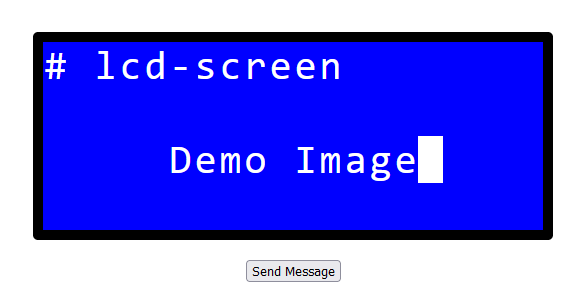
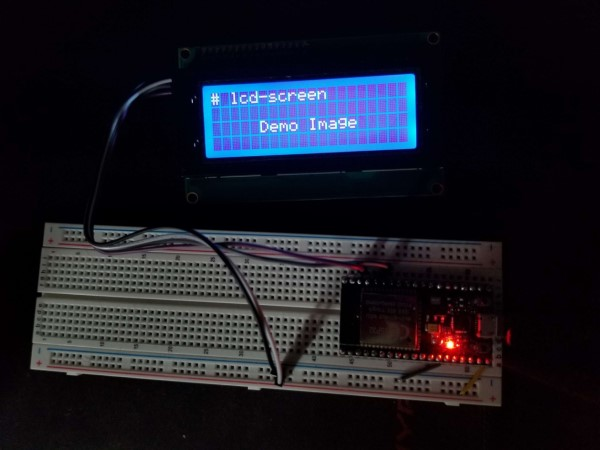

# lcd-screen
ESP32 program that runs an HTTP server and allows posting text to an LCD screen over I2C.
The `docs/` directory contains a simple website to create and messages through a UI. You can view the website at http://boelling.ca/lcd-screen/.

## Images

Website UI and corresponding display on the LCD screen.

## Secrets
Create a file `main/secrets.h` that defines the network credentials `SECRET_SSID` and `SECRET_PASSWORD`.